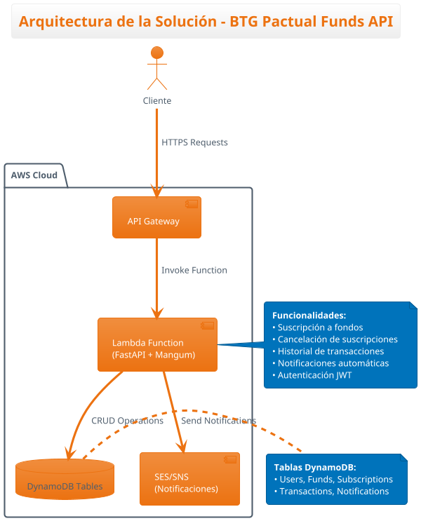

# BTG Pactual - GTC Prueba Técnica

API REST para gestión de fondos de inversión desarrollada con Python y FastAPI.

## Funcionalidades

- Suscripción a fondos de inversión
- Cancelación de suscripciones
- Historial de transacciones
- Notificaciones por email/SMS
- Autenticación JWT

## Tecnologías

- Python 3.11
- FastAPI
- AWS Lambda
- DynamoDB
- Serverless Framework

## Arquitectura



## Despliegue

```bash
npm install
npm run deploy:prod
```

## API Endpoints

### Autenticación
- POST /api/v1/auth/login - Iniciar sesión
- POST /api/v1/auth/register - Registro de usuarios

### Usuarios
- POST /api/v1/users - Crear usuario
- GET /api/v1/users/{user_id} - Obtener usuario
- GET /api/v1/users - Listar usuarios (Admin)
- PUT /api/v1/users/{user_id} - Actualizar usuario

### Fondos
- GET /api/v1/funds - Listar todos los fondos
- GET /api/v1/funds/active - Listar fondos activos
- GET /api/v1/funds/{fund_id} - Obtener fondo específico
- POST /api/v1/funds - Crear fondo (Admin)
- PUT /api/v1/funds/{fund_id} - Actualizar fondo (Admin)

### Suscripciones
- POST /api/v1/subscriptions - Suscribirse a fondo
- GET /api/v1/subscriptions/user/{user_id} - Ver suscripciones del usuario
- GET /api/v1/subscriptions/user/{user_id}/active - Ver suscripciones activas
- DELETE /api/v1/subscriptions/{subscription_id} - Cancelar suscripción

### Transacciones
- GET /api/v1/transactions/user/{user_id} - Historial de transacciones
- GET /api/v1/transactions/{transaction_id} - Obtener transacción específica

### Notificaciones
- GET /api/v1/notifications/user/{user_id} - Ver notificaciones del usuario
- GET /api/v1/notifications/{notification_id} - Obtener notificación específica

## Pruebas

```bash
python run_tests.py
```

## URL de Producción

https://dnldsxlor4.execute-api.us-east-2.amazonaws.com/prod

## Parte 2 - SQL (20%)

Incluye scripts SQL para PostgreSQL con:
- Script de creación de base de datos BTG
- Datos de prueba para testing
- Consulta SQL compleja requerida
- Documentación completa

Ver carpeta `sql/` para más detalles.
